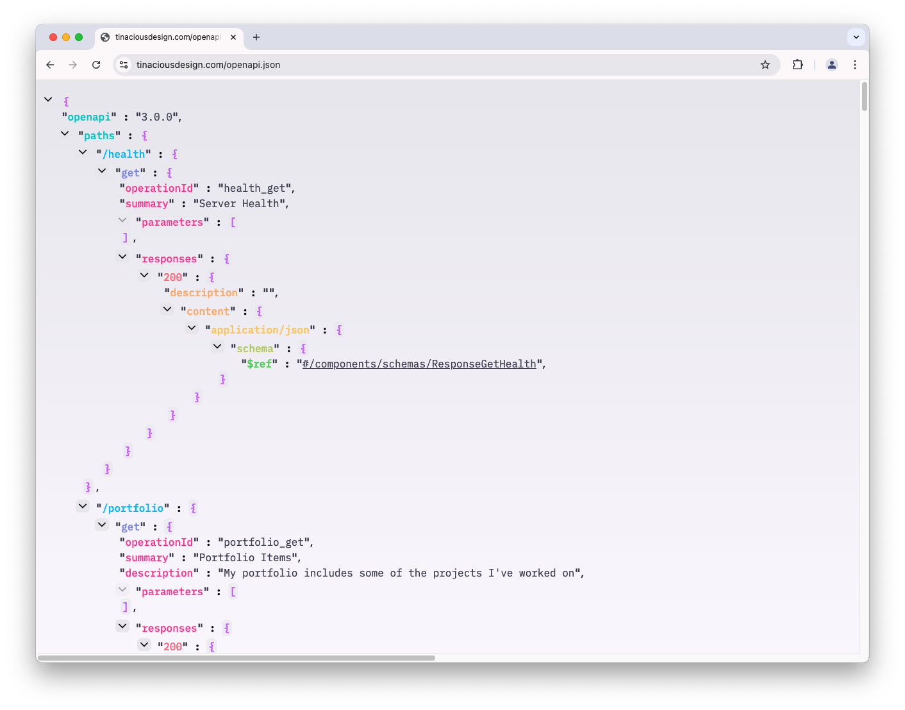
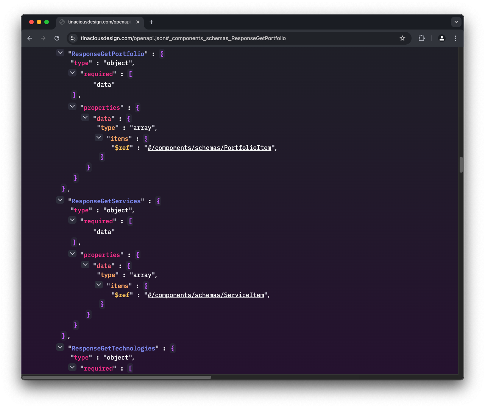

# 🌈 Rainbow JSON Viewer

**Rainbow JSON Viewer** is a Chrome extension that customizes the display of JSON in the browser.

- [How it works](#how-it-works)
- [Features](#features)
- [Related themes](#related-themes)
- [Tools, Libraries and other credits](#tools-libraries-and-other-credits)
- [Screenshots](#screenshots)
  - [Dark mode](#dark-mode)
  - [Light mode](#light-mode)
  - [External link support](#external-link-support)
  - [OpenAPI link support](#openapi-link-support)
- [Installation](#installation)
- [Development](#development)

## How it works

The extension uses the document's content type to decide if it should style the JSON.

## Features

- 🌈 **Rainbow JSON**: Each level of JSON properties are a different colour to help with readability
- 🌝🌚 **Dark/Light mode**: Automatic light and dark mode detection that uses your operating system's default
- 🪗 **Show/Hide**: Expand or collapse sections of JSON
- 🔗 **Link support**: Supports external links as well as internal links for OpenAPI specs
- 📋 **Copy raw JSON**: Copy button allows you to copy the raw JSON to your clipboard
- ⛔️ **Ignorelist**: Add URLs to an ignore list to prevent the extension from running on those URLs

## Related themes

If you like this extension, you might like my code editor themes:

- [Visual Studio Code](https://marketplace.visualstudio.com/items?itemName=tinaciousdesign.theme-tinaciousdesign) (has rainbow JSON)
- [Zed](https://gist.github.com/tinacious/dbdf82337ee6b461f438c6eb56ccb7b6)
- [Jetbrains](https://github.com/tinacious/jetbrains-tinacious-design-theme)
- [XCode](https://github.com/tinacious/tinacious-xcode-color-theme)
- [iTerm](https://github.com/tinacious/iterm-tinacious-design-theme)
- [Sublime Text](https://github.com/tinacious/sublime-tinacious-design-syntax)

## Tools, Libraries and other credits

- [TypeScript](https://www.typescriptlang.org/)
- [Svelte](https://svelte.dev/)
- [Vite](https://vite.dev/)
- [Tailwind CSS](https://tailwindcss.com)
- [postcss](https://postcss.org/)
- [Ionicons](https://ionic.io/ionicons) and [Grommet icons](https://icons.grommet.io/) using [react-icons Figma plugin](https://www.figma.com/community/plugin/921172243620367846/import-react-icons))
- [Figma](https://www.figma.com/)
- [IBM Plex Mono](https://fonts.google.com/specimen/IBM+Plex+Mono) is the font used

## Screenshots

### Dark mode

### Light mode

### External link support

### OpenAPI link support

## Installation

Clone and build locally or download from one of the [workflow runs](https://github.com/tinacious/rainbow-json-chrome/actions/workflows/package.yml).

## Development

See `.nvmrc` for the Node version.

Install dependencies:

    npm install

Run the development server:

    npm run dev

Build:

    npm run build

This will create the folder `rainbow-json-chrome`. This can be [loaded as an unpacked extension](https://knowledge.workspace.google.com/kb/load-unpacked-extensions-000005962) in Chrome.
